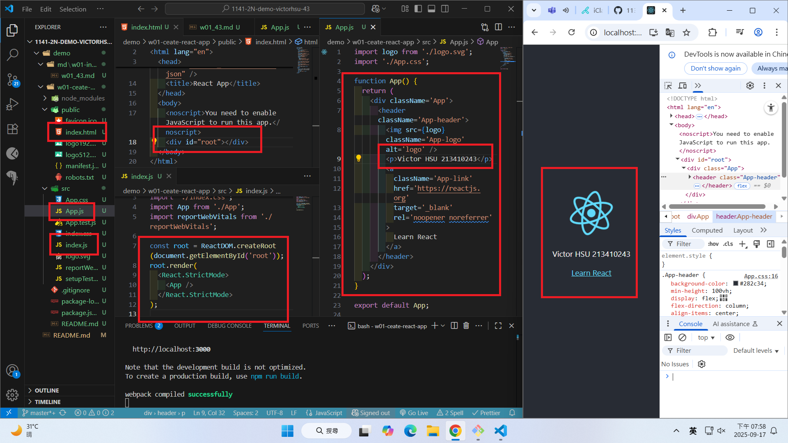
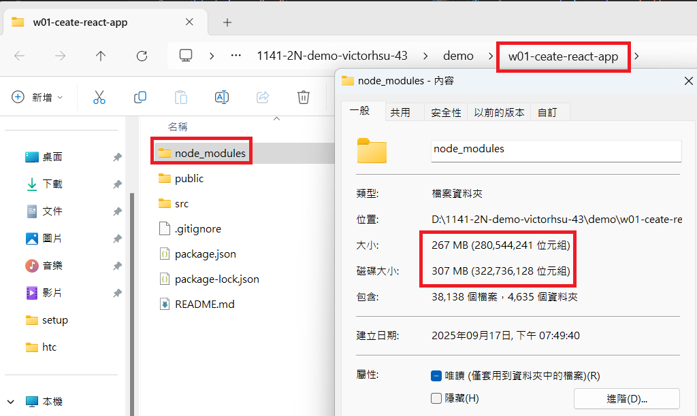
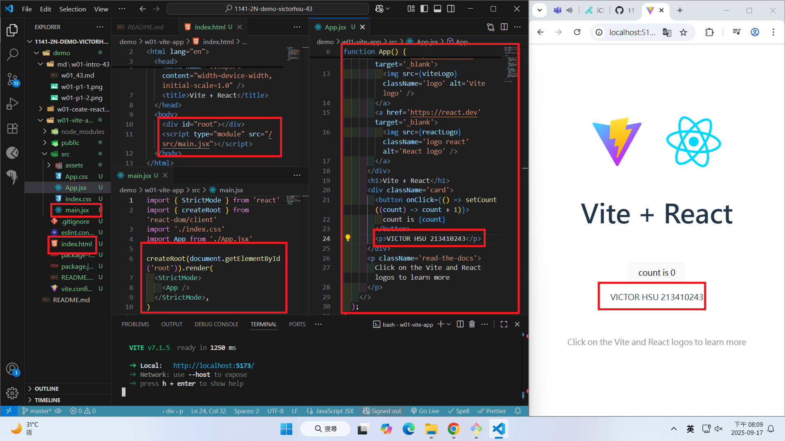
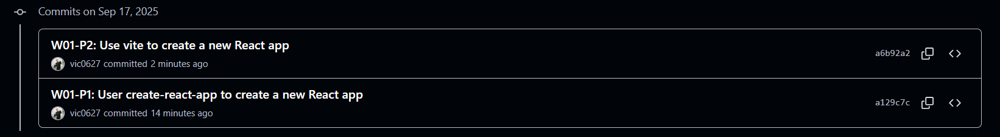
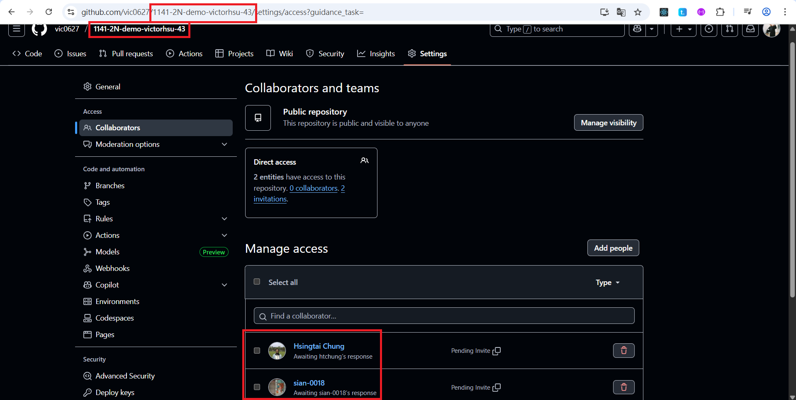

[GitHub URL](https://github.com/vic0627/1141-2N-demo-victorhsu-43)

### W01-P1: User create-react-app to create a new React app

#### => show how the index.html page being rendered



#### => share the size of node modules



```
a129c7c VICTOR HSU      Wed Sep 17 20:03:27 2025 +0800  W01-P1: User create-react-app to create a new React app
```

### W01-P2: Use vite to create a new React app

#### => show how the index.html page being rendered



#### => share the size of node modules


```
a6b92a2 VICTOR HSU      Wed Sep 17 20:15:10 2025 +0800  W01-P2: Use vite to create a new React app
```

### W01-logs: git logs of W01




