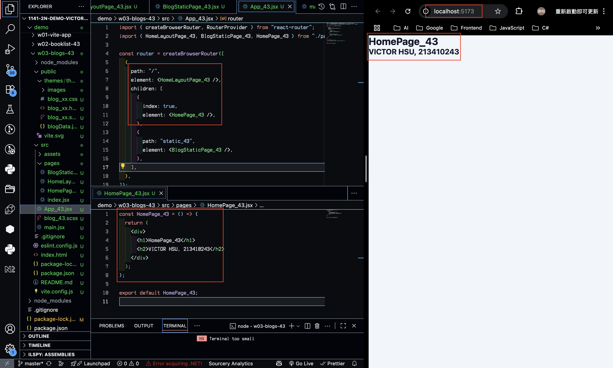
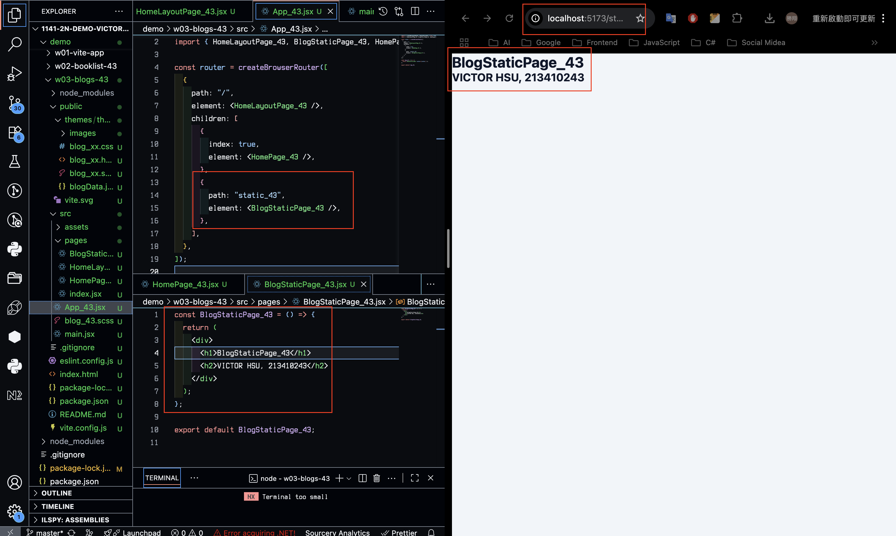
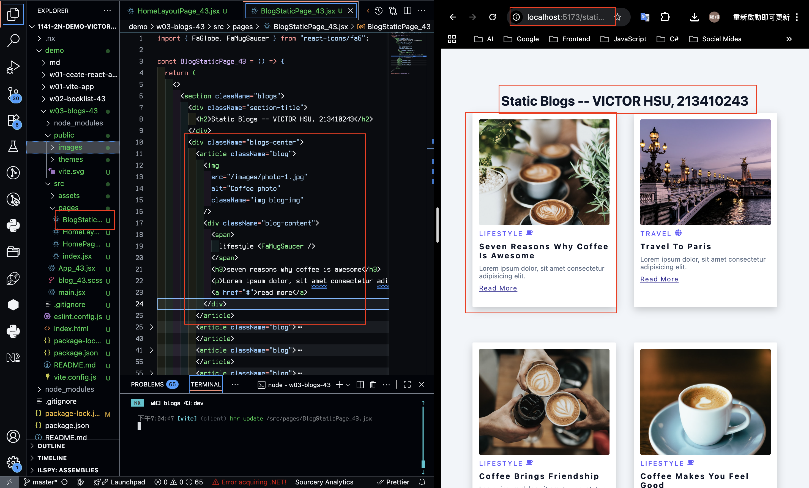
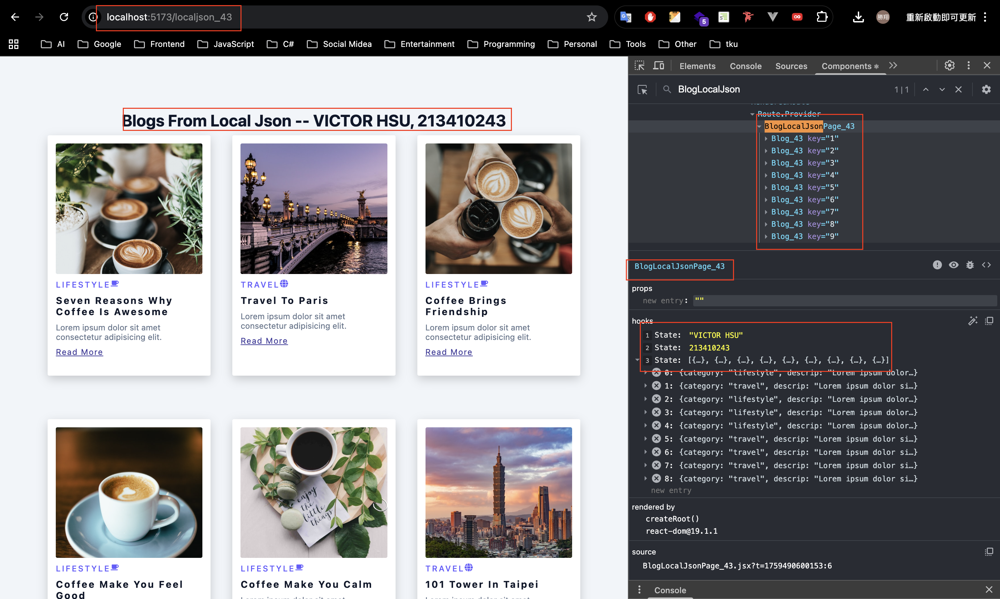
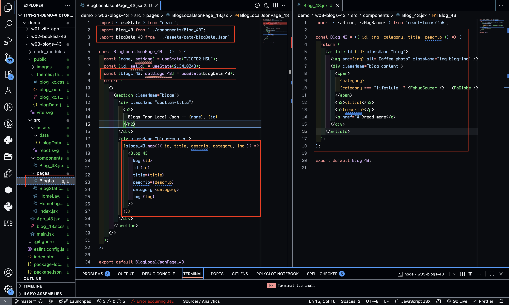
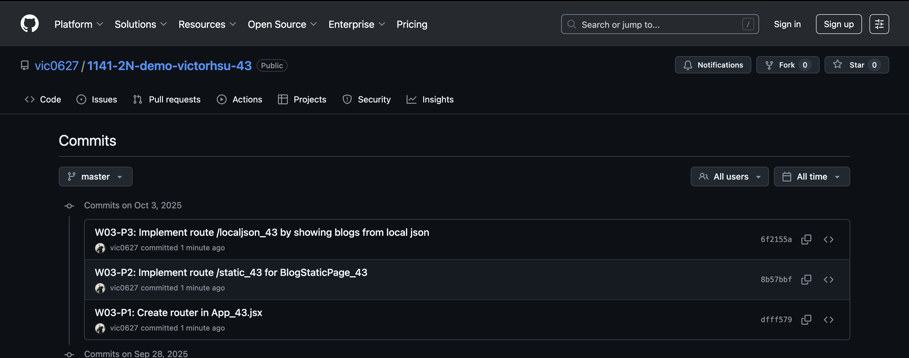

[GitHub URL](https://github.com/vic0627/1141-2N-demo-victorhsu-43)

### W03-P1: Create router in App_43.jsx

#### => route / for HomePage_43



#### => route /static_43 for BlogStaticPage_43



```
dfff579 victor_xu       Fri Oct 3 19:33:02 2025 +0800   W03-P1: Create router in App_43.jsx
```

### W03-P2: Implement route /static_43 for BlogStaticPage_43



```
8b57bbf victor_xu       Fri Oct 3 19:33:28 2025 +0800   W03-P2: Implement route /static_43 for BlogStaticPage_43
```

### W03-P3: Implement route /localjson_43 by showing blogs from local json

#### => Chrome demo using React DevTools



#### => code for BlogLocalJson_43



```
6f2155a victor_xu       Fri Oct 3 19:33:46 2025 +0800   W03-P3: Implement route /localjson_43 by showing blogs from local json
```

### W03-logs: git logs of W03


