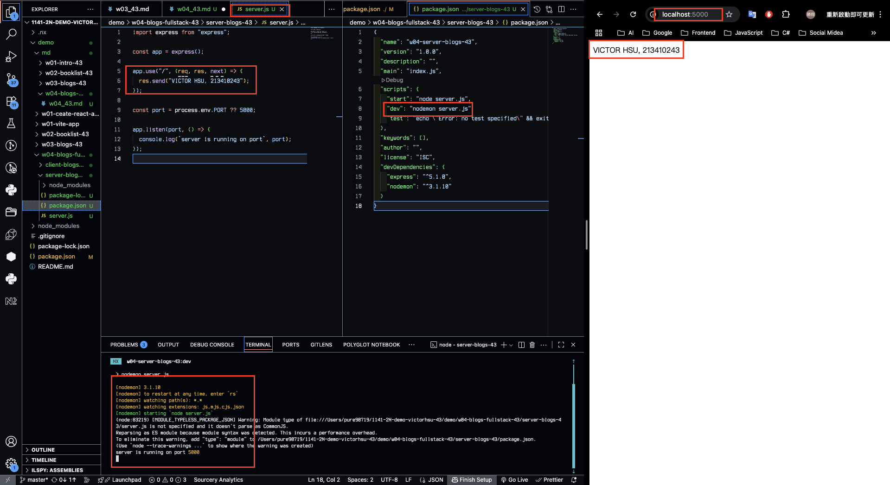
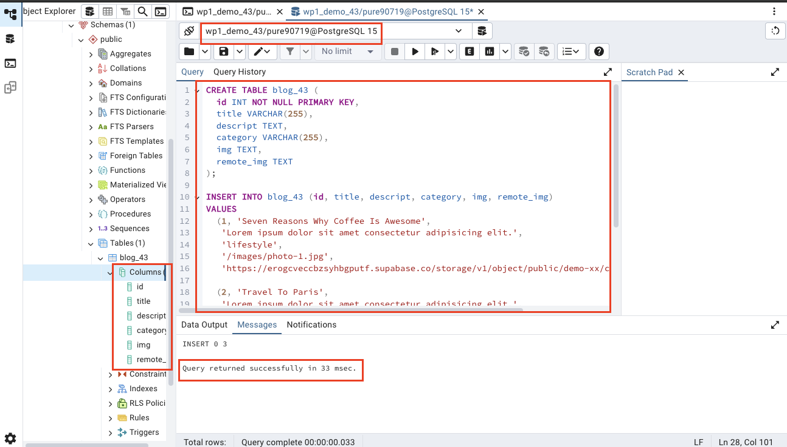
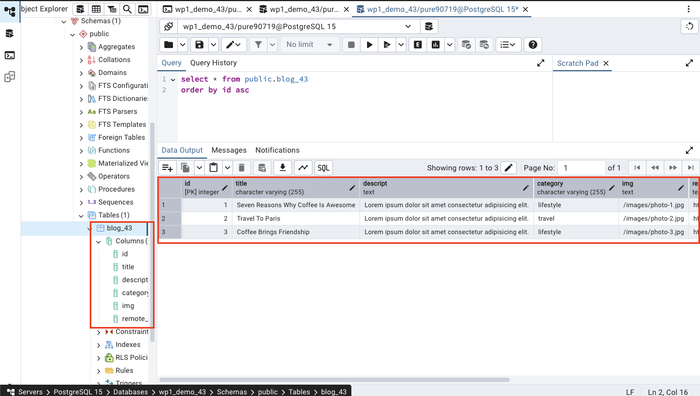
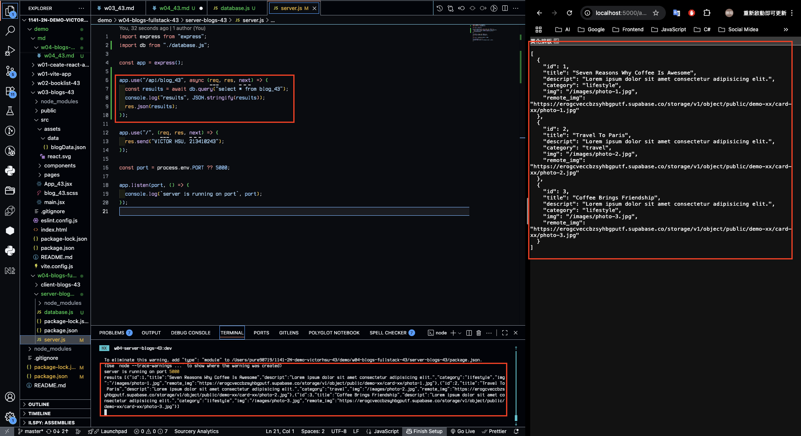
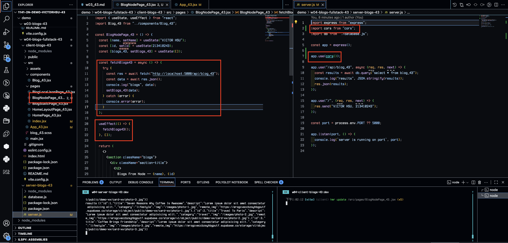
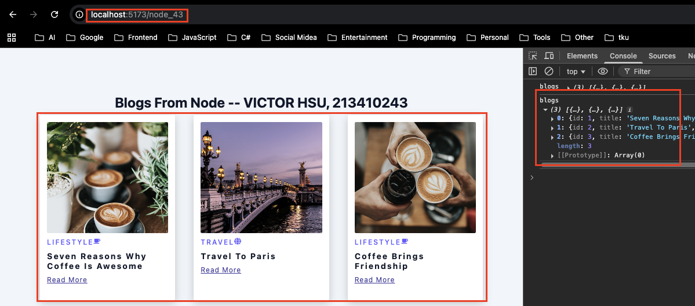
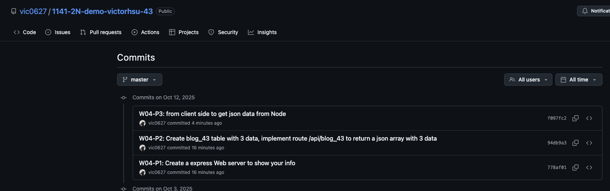

[GitHub URL](https://github.com/vic0627/1141-2N-demo-victorhsu-43)

### W04-P1: Create a express Web server to show your info



```
778af01 victor_xu       Sun Oct 12 12:29:03 2025 +0800  W04-P1: Create a express Web server to show your info
```

### W04-P2: Create blog_43 table with 3 data, implement route /api/blog_43 to return a json array with 3 data

#### => SQL to create blog_43 table and 3 data



#### => show 3 data



#### => implement route /api/blog_43



```
94db9a3 victor_xu       Sun Oct 12 12:52:43 2025 +0800  W04-P2: Create blog_43 table with 3 data, implement route /api/blog_43 to return a json array with 3 data
```

### W04-P3: from client side to get json data from Node

#### => modified client and server code



#### => Chrome, show 3 blogs



```
f097fc2 victor_xu       Sun Oct 12 13:06:06 2025 +0800  W04-P3: from client side to get json data from Node
```

### W04-logs: git logs of W04


