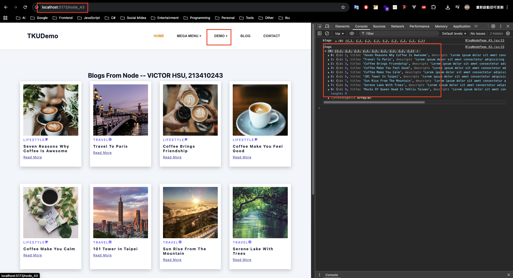
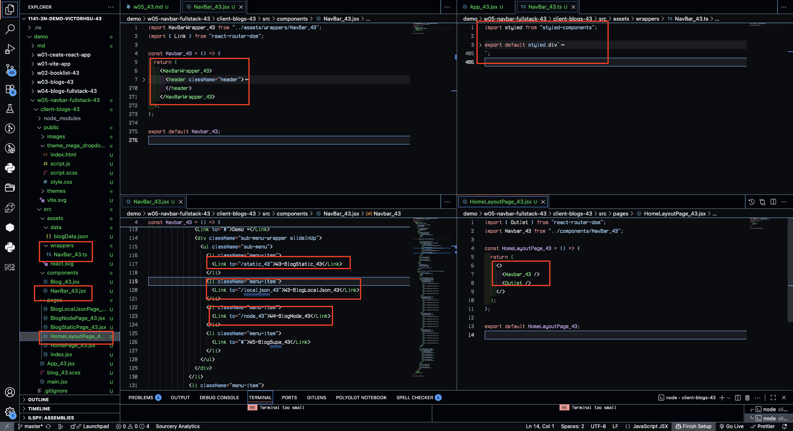
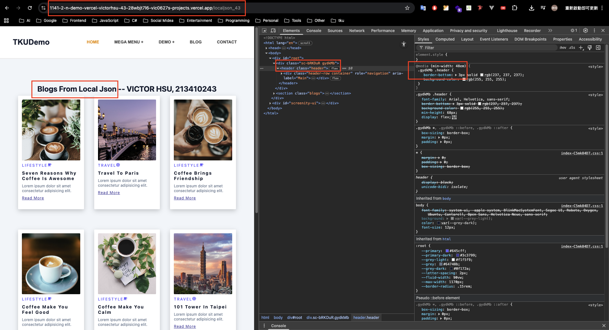
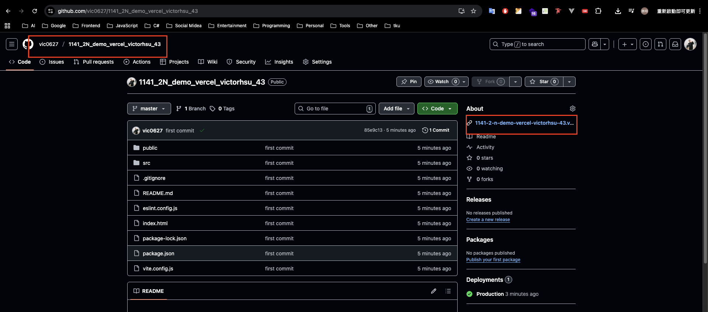
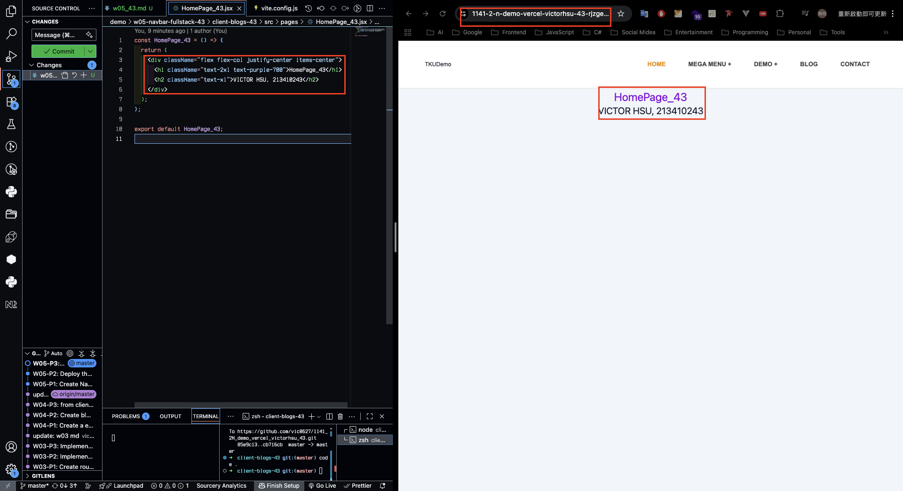
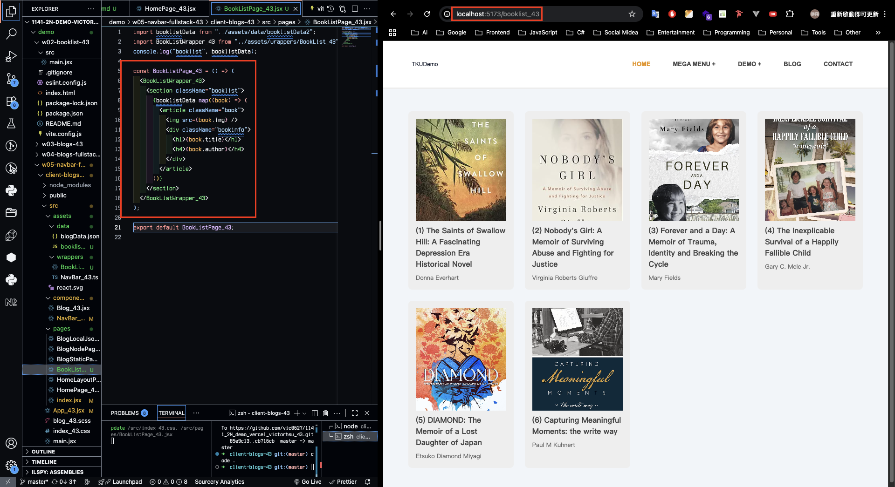
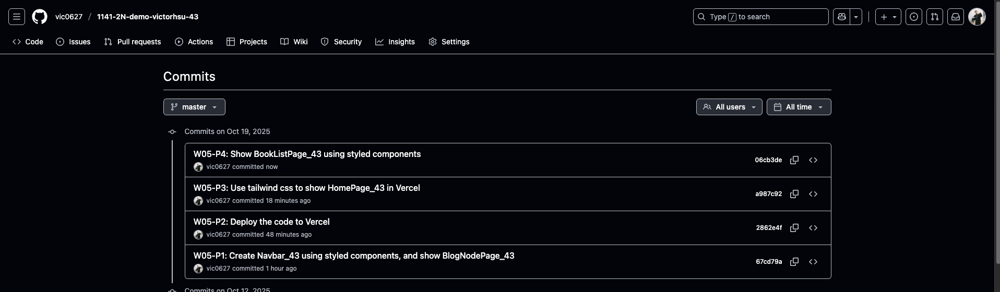

[GitHub URL](https://github.com/vic0627/1141-2N-demo-victorhsu-43)
[Github URL for Vercel](https://github.com/vic0627/1141_2N_demo_vercel_victorhsu_43)
[Vercel URL](https://1141-2-n-demo-vercel-victorhsu-43-28wbjt7l6-vic0627s-projects.vercel.app/)

### W05-P1: Create Navbar_43 using styled components, and show BlogNodePage_43

##### => Chrome



##### => relevant code



```
67cd79a victor_xu       Sun Oct 19 16:33:09 2025 +0800  W05-P1: Create Navbar_43 using styled components, and show BlogNodePage_43
```

### W05-P2: Deploy the code to Vercel

#### => Show BlogLocalJson in Vercel



#### => Github repo with Vercel link



#### => Github demo_vecel repo and Vercel URL

[Github URL for Vercel](https://github.com/vic0627/1141_2N_demo_vercel_victorhsu_43)
[Vercel URL](https://1141-2-n-demo-vercel-victorhsu-43-28wbjt7l6-vic0627s-projects.vercel.app/)

```
2862e4f victor_xu       Sun Oct 19 16:45:50 2025 +0800  W05-P2: Deploy the code to Vercel
```

### W05-P3: Use tailwind css to show HomePage_43 in Vercel



```
a987c92 victor_xu       Sun Oct 19 17:15:47 2025 +0800  W05-P3: Use tailwind css to show HomePage_43 in Vercel
```

### W05-P4: Show BookListPage_43 using styled components



```
06cb3de victor_xu       Sun Oct 19 17:33:21 2025 +0800  W05-P4: Show BookListPage_43 using styled components
```

### W05-logs: git logs of W05


