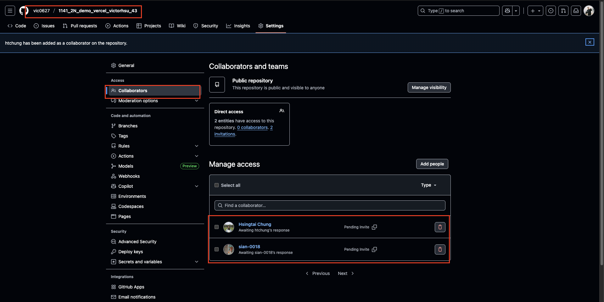
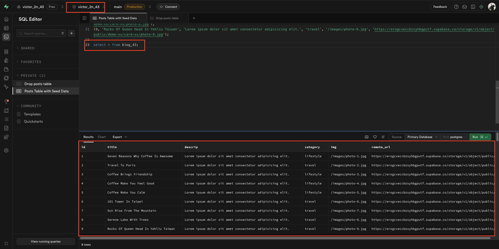
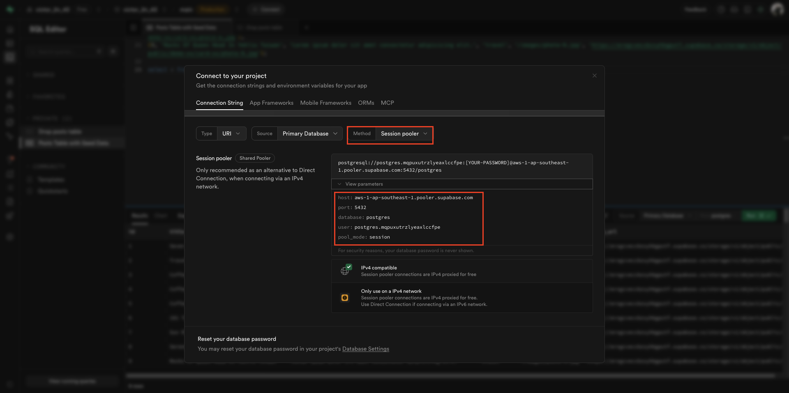
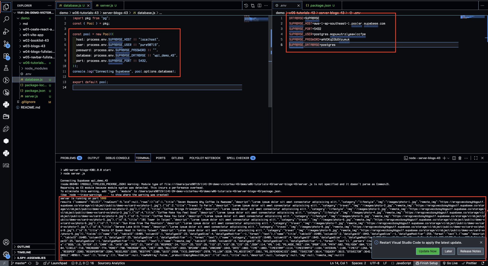
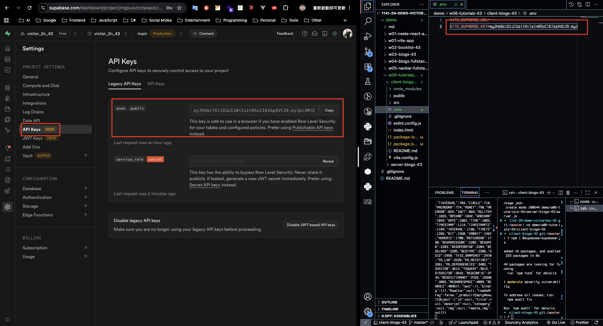
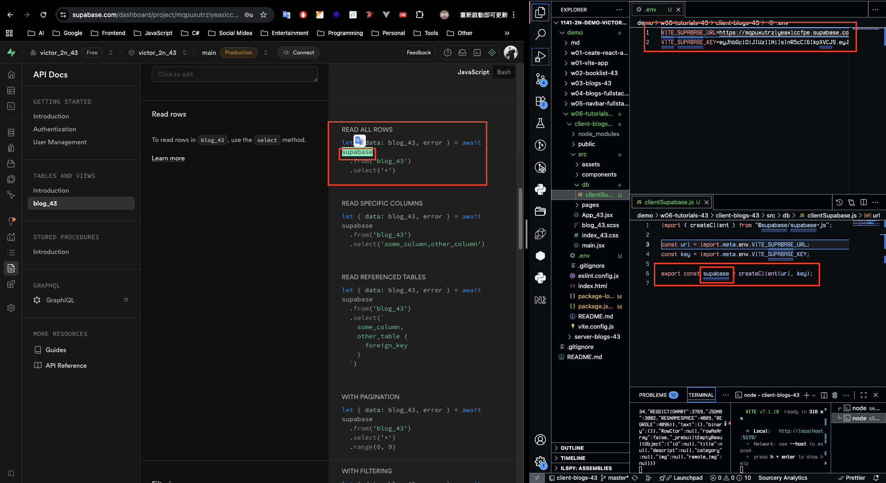
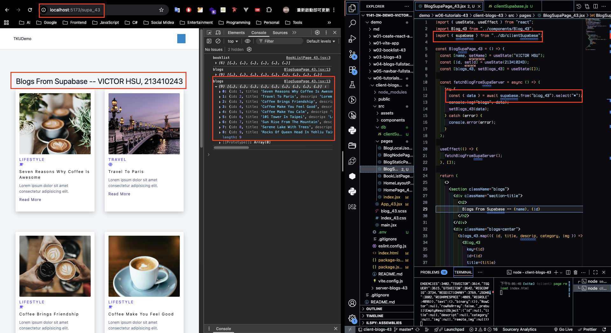
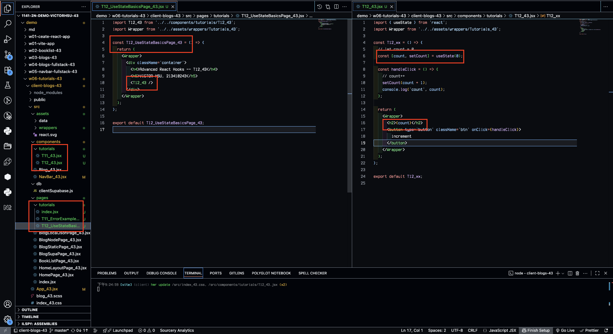
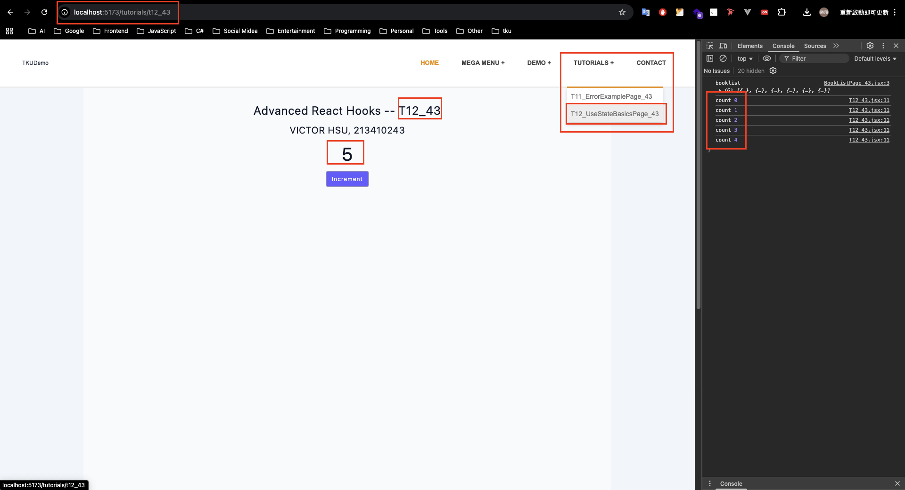
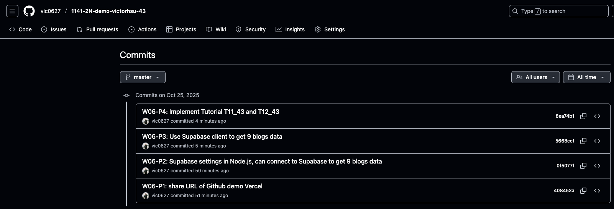

[GitHub URL](https://github.com/vic0627/1141-2N-demo-victorhsu-43)
[Github URL for Vercel](https://github.com/vic0627/1141_2N_demo_vercel_victorhsu_43)
[Vercel URL](https://1141-2-n-demo-vercel-victorhsu-43-28wbjt7l6-vic0627s-projects.vercel.app/)

### W06-P1: share URL of Github demo Vercel



```
408453a victor_xu       Sat Oct 25 20:50:12 2025 +0800  W06-P1: share URL of Github demo Vercel
```

### W06-P2: Supabase settings in Node.js, can connect to Supabase to get 9 blogs data

#### => able to get 9 blogs data in Supabase



#### => connect parameters in Supabase



#### => server code in Supabase setting



```
0f5077f victor_xu       Sat Oct 25 20:50:25 2025 +0800  W06-P2: Supabase settings in Node.js, can connect to Supabase to get 9 blogs data
```

### W06-P3: Use Supabase client to get 9 blogs data

#### => show API keys in Supabase



#### => Supabase client code



#### => Use BlogSupaPage_43.jsx to get blogs data from Supabase



```
5668ccf victor_xu       Sat Oct 25 21:35:47 2025 +0800  W06-P3: Use Supabase client to get 9 blogs data
```

### W06-P4: Implement Tutorial T11_43 and T12_43

#### => show code for T12_43



#### => Chrome result



```
8ea74b1 victor_xu       Sat Oct 25 21:36:14 2025 +0800  W06-P4: Implement Tutorial T11_43 and T12_43
```

### W06-logs: git logs of W06


