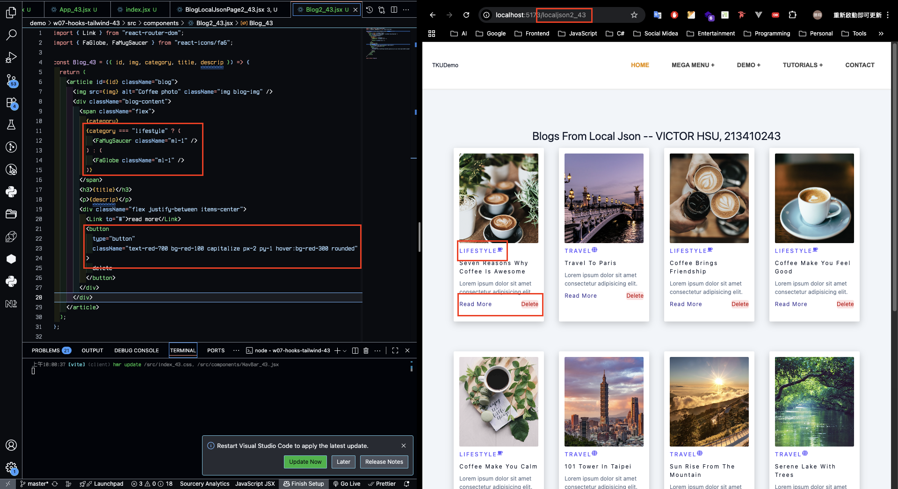
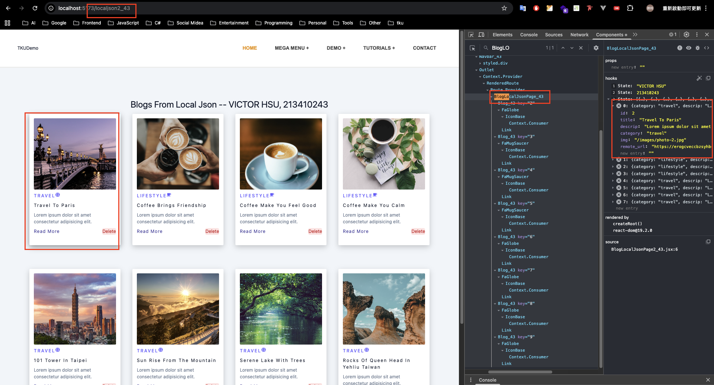
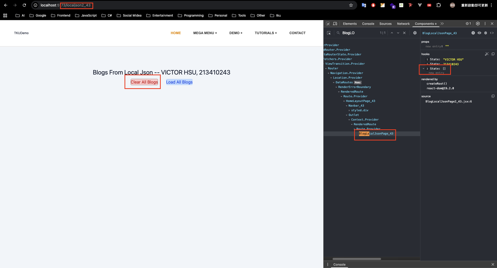
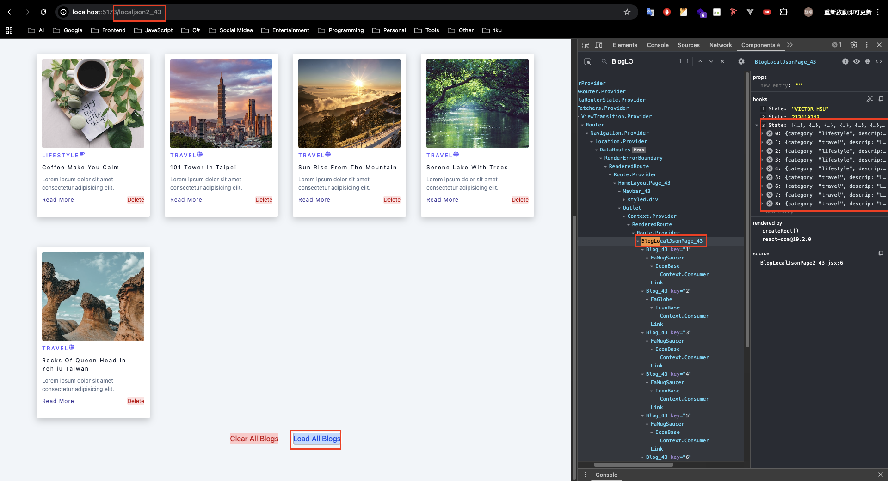
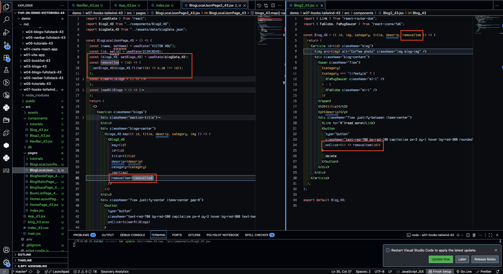
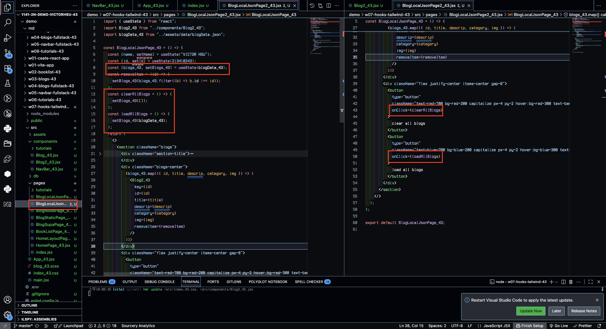
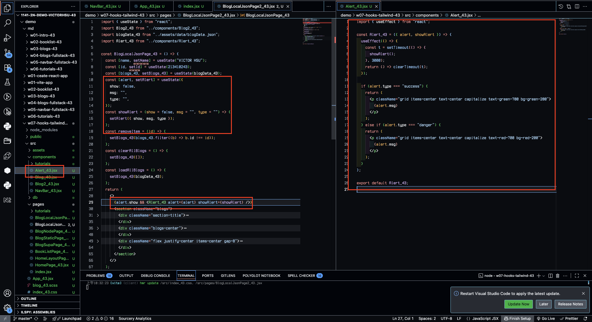
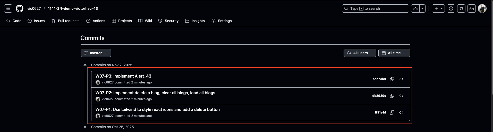

[GitHub URL](https://github.com/vic0627/1141-2N-demo-victorhsu-43)
[Github URL for Vercel](https://github.com/vic0627/1141_2N_demo_vercel_victorhsu_43)
[Vercel URL](https://1141-2-n-demo-vercel-victorhsu-43-28wbjt7l6-vic0627s-projects.vercel.app/)

### W07-P1: Use tailwind to style react icons and add a delete button



```
1f91e1d victor_xu       Sun Nov 2 10:34:48 2025 +0800   W07-P1: Use tailwind to style react icons and add a delete button
```

### W07-P2: Implement delete a blog, clear all blogs, load all blogs

#### => delete first blog



#### => clear all blogs



#### => load all blogs



#### => code for deleting a blog



#### => code for clear and load all blogs



```
db8939c victor_xu       Sun Nov 2 10:35:04 2025 +0800   W07-P2: Implement delete a blog, clear all blogs, load all blogs
```

### W07-P3: Implement Alert_xx

#### => code for Alert_xx



```
bddaab8 victor_xu       Sun Nov 2 10:35:21 2025 +0800   W07-P3: Implement Alert_43
```

### W07-logs: git logs of W07


