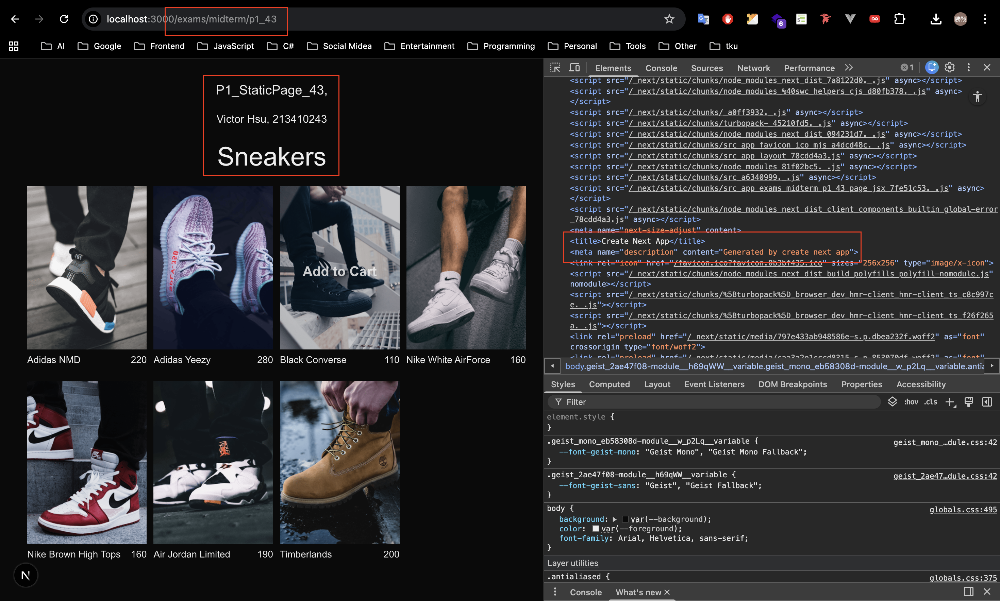
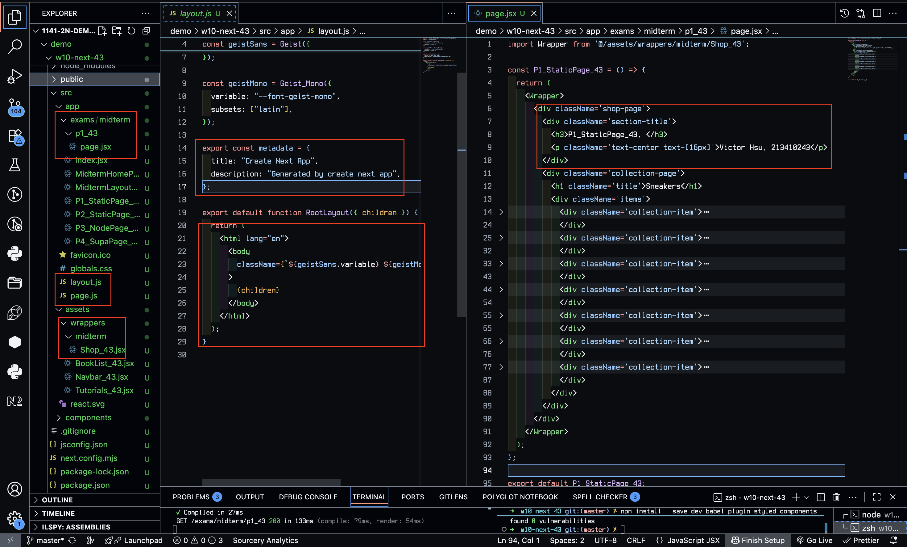
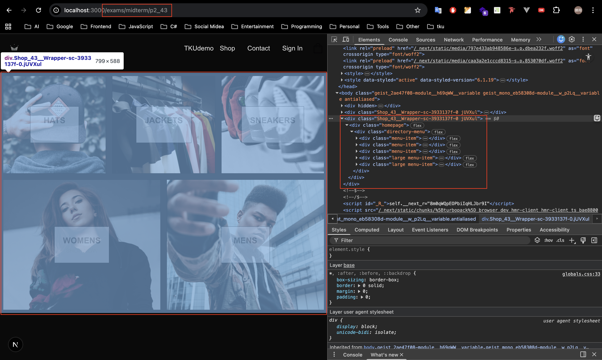
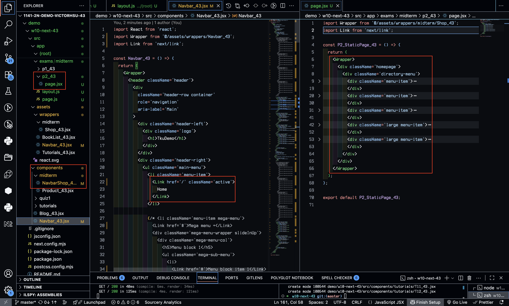
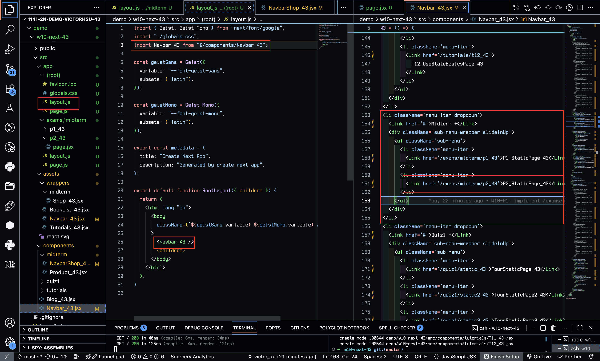
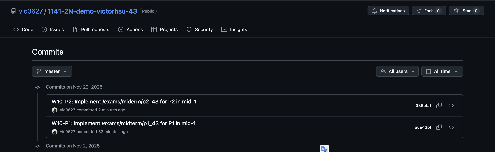

[GitHub URL](https://github.com/vic0627/1141-2N-demo-victorhsu-43)
[Github URL for Vercel](https://github.com/vic0627/1141_2N_demo_vercel_victorhsu_43)
[Vercel URL](https://1141-2-n-demo-vercel-victorhsu-43-28wbjt7l6-vic0627s-projects.vercel.app/)

### W10-P1: implement /exams/midterm/p1_43 for P1 in mid-1

##### => Chrome, show P1 page with meta data



##### => show the relevant code



```
a5e43bf victor_xu       Sat Nov 22 10:54:58 2025 +0800  W10-P1: implement /exams/midterm/p1_43 for P1 in mid-1
```

### W10-P2: Implement /exams/miderm/p2_43 for P2 in mid-1

#### => shown in Chrome



#### => the relevant code for P2



#### => Navbar_43 for root layout



```
336efa1 victor_xu       Sat Nov 22 11:25:32 2025 +0800  W10-P2: Implement /exams/miderm/p2_43 for P2 in mid-1
```

### W10-logs: git logs of W10


