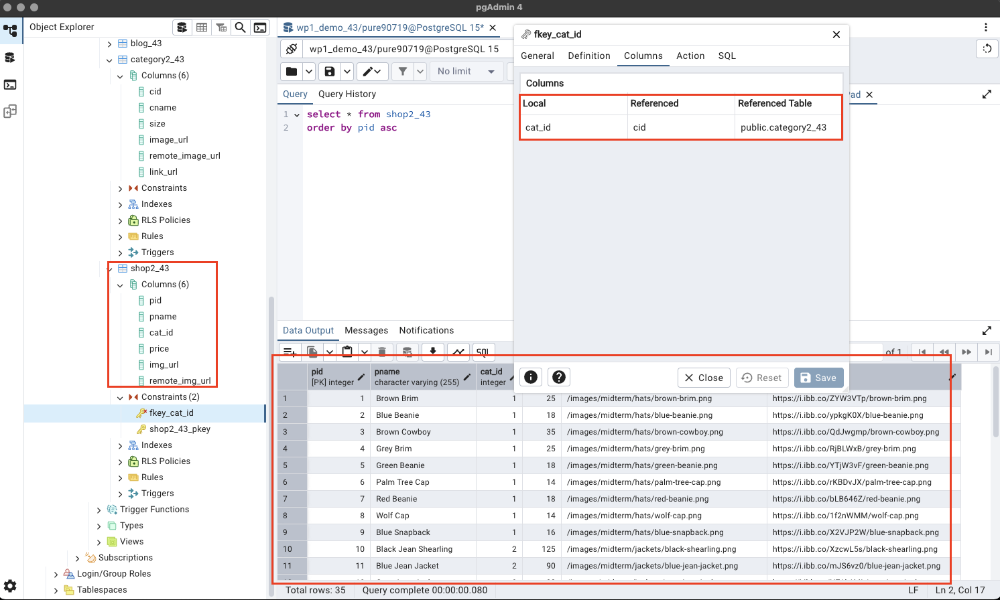
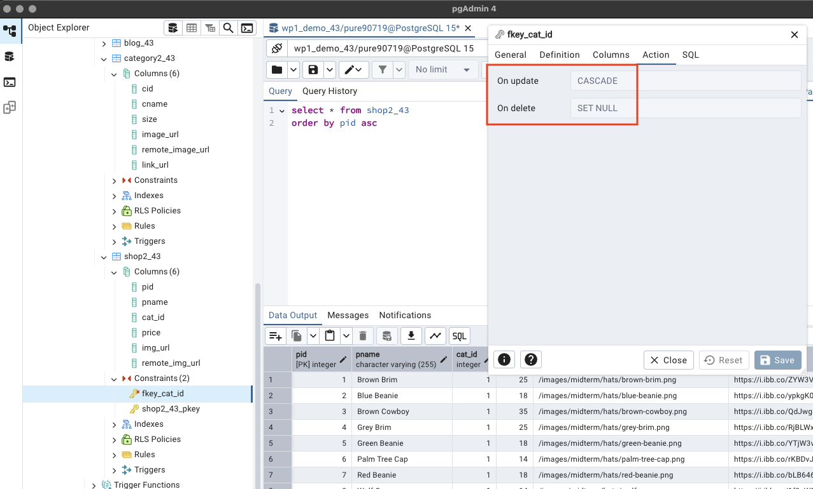
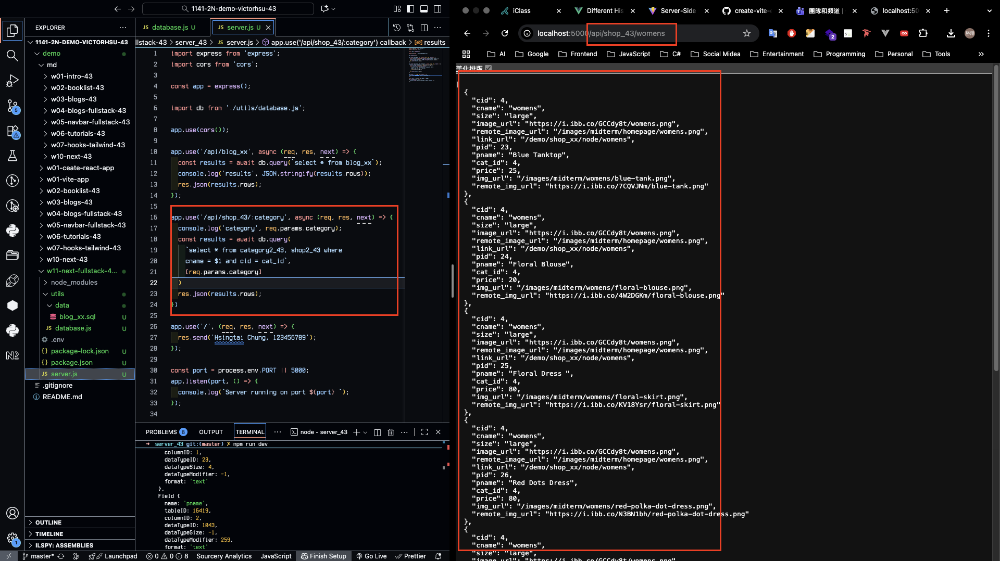
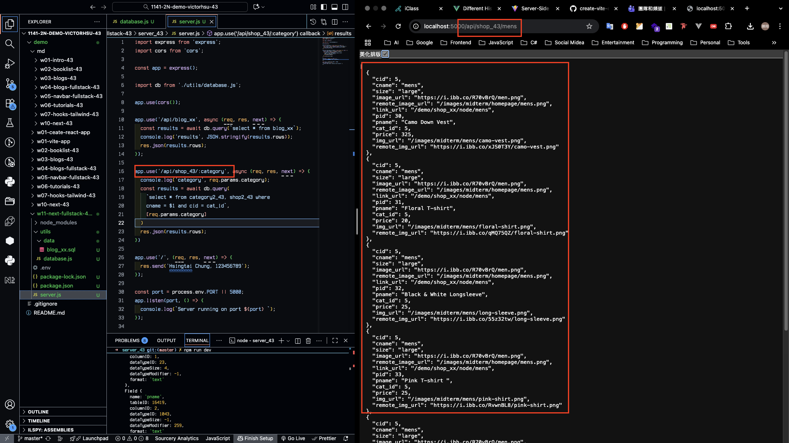
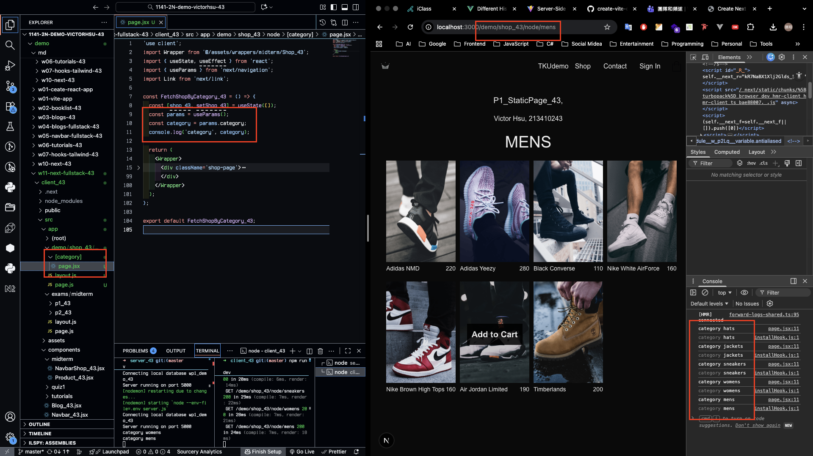
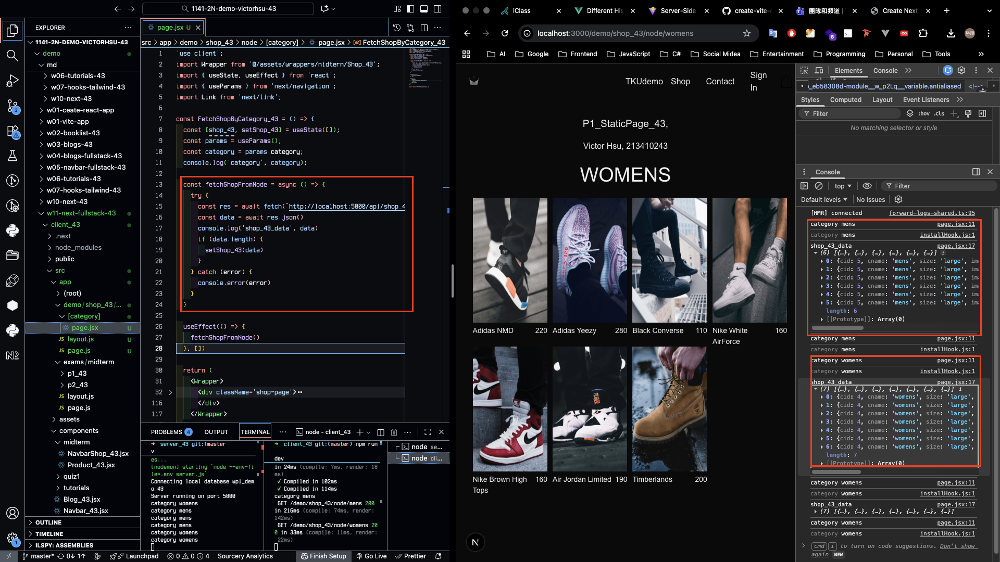
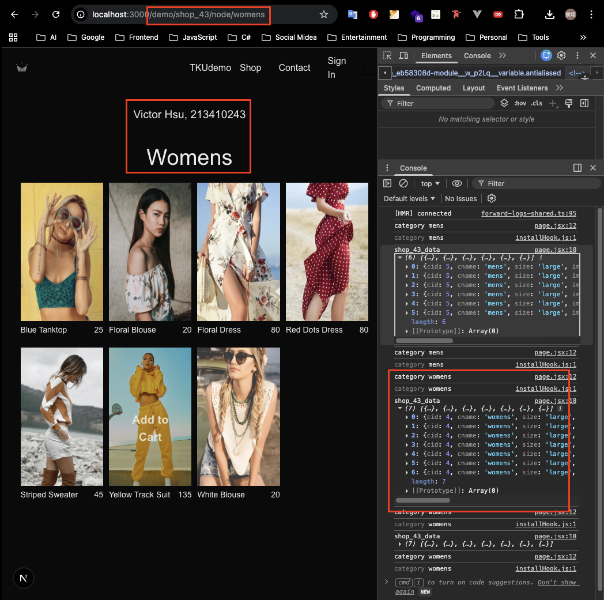
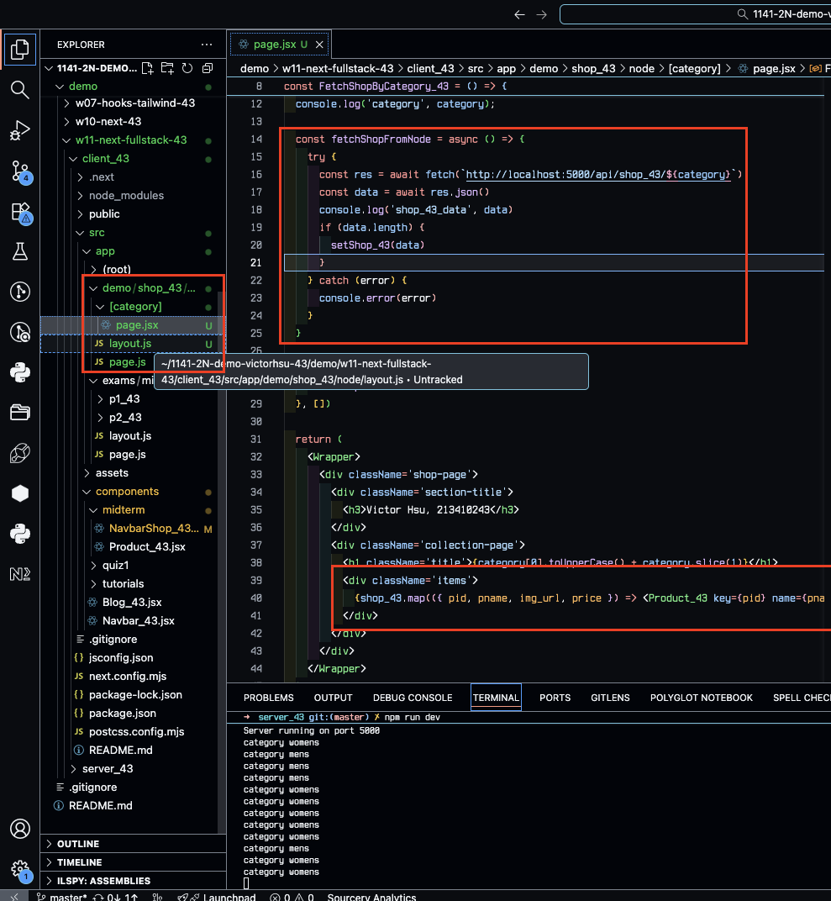
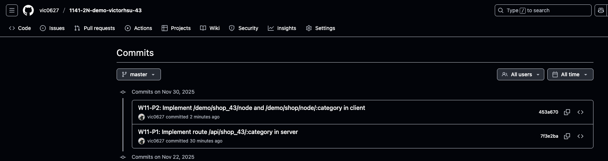

[GitHub URL](https://github.com/vic0627/1141-2N-demo-victorhsu-43)
[Github URL for Vercel](https://github.com/vic0627/1141_2N_demo_vercel_victorhsu_43)
[Vercel URL](https://1141-2-n-demo-vercel-victorhsu-43-28wbjt7l6-vic0627s-projects.vercel.app/)

### W11-P1: Implement route /api/shop_43/:category in server
 
##### => create tables category2_43 and shop2_43 using SQL and set foreign key of cat_id referencing to cid in category2_43
 

 
##### => update and delete constraints of the foreign key
 

 
##### => Chrome, show /api/shop_43/womens with code (you need to use last two digits of your id)
 

 
##### => Chrome, show /api/shop_43/mens with code (you need to use last two digits of your id)
 

 
```
7f3e2ba victor_xu       Sun Nov 30 17:36:58 2025 +0800  W11-P1: Implement route /api/shop_43/:category in server
```

### W11-P2: Implement /demo/shop_43/node and /demo/shop/node/:category in client
 
#### => show how to get category from params
 

 
#### => show how to fetch category from the category main page
 

 
#### => Chrome, show FetchShopByCategory_43.jsx by click Mens
 

 
#### => relevant code for FetchShopByCategory_43
 

 
```
453a670 victor_xu       Sun Nov 30 18:04:10 2025 +0800  W11-P2: Implement /demo/shop_43/node and /demo/shop/node/:category in client
```

### W11-logs: git logs of W11


