[GitHub URL](https://github.com/vic0627/1141-2N-demo-victorhsu-43)
[Github URL for Vercel](https://github.com/vic0627/1141_2N_demo_vercel_victorhsu_43)
[Vercel URL](https://1141-2-n-demo-vercel-victorhsu-43-28wbjt7l6-vic0627s-projects.vercel.app/)

### W12-P1: Refine code of /demo/shop_43/node
 
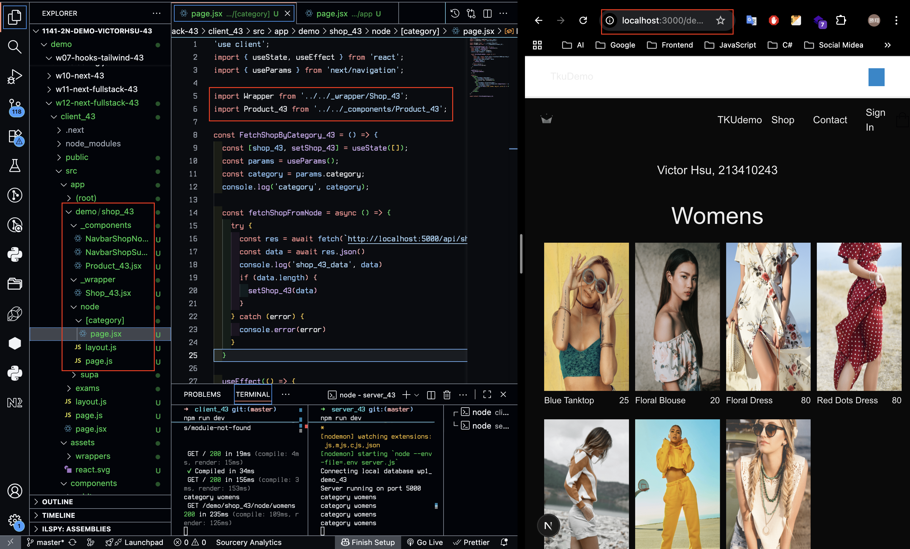
 
```
5398e32 victor_xu       Sat Dec 6 11:06:20 2025 +0800   W12-P1: Refine code of /demo/shop_43/node
```
 
### W12-P2: Deploy code to Vercel
 
#### => npm run build
 
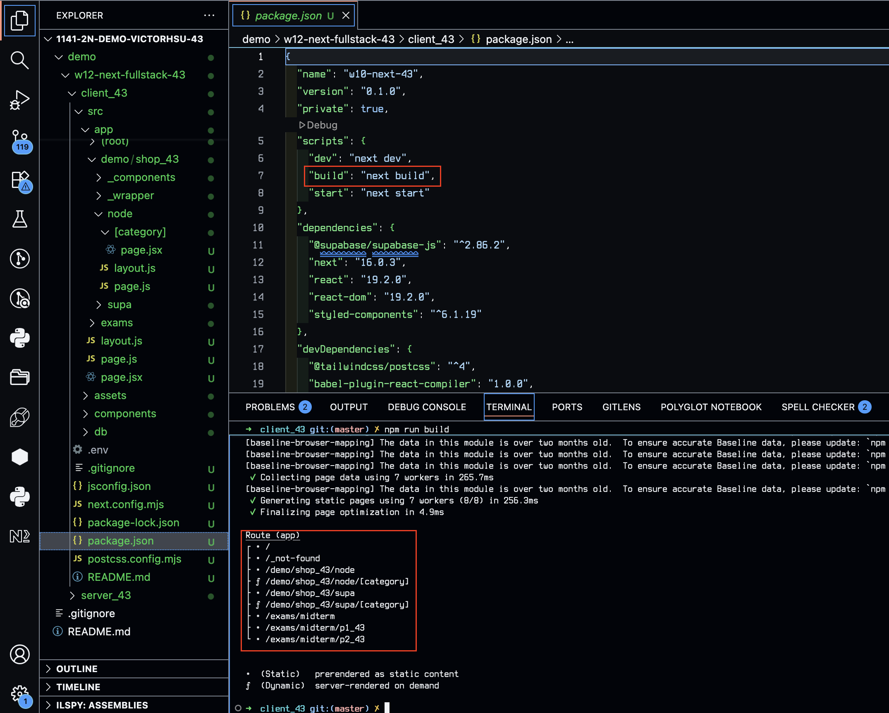
 
#### => npm start
 
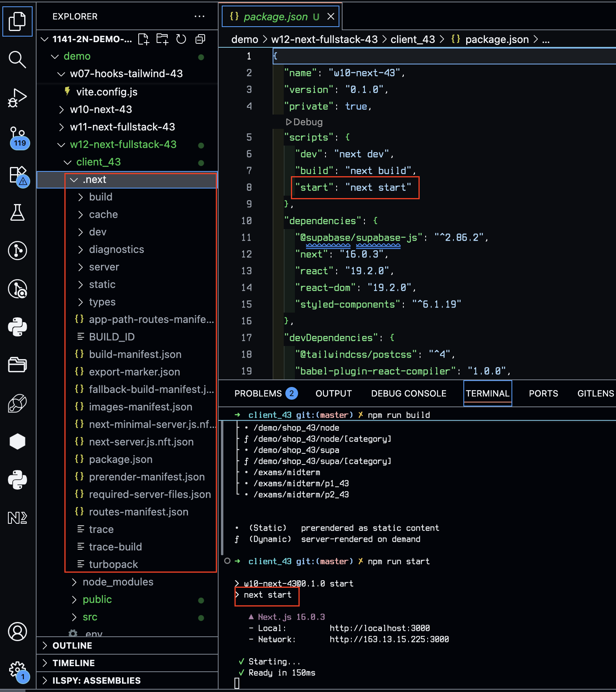
 
#### => Vercel, add environment variables
 
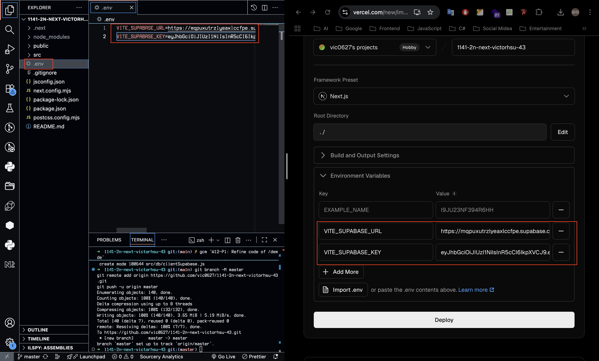
 
#### => Vercel homepage success
 
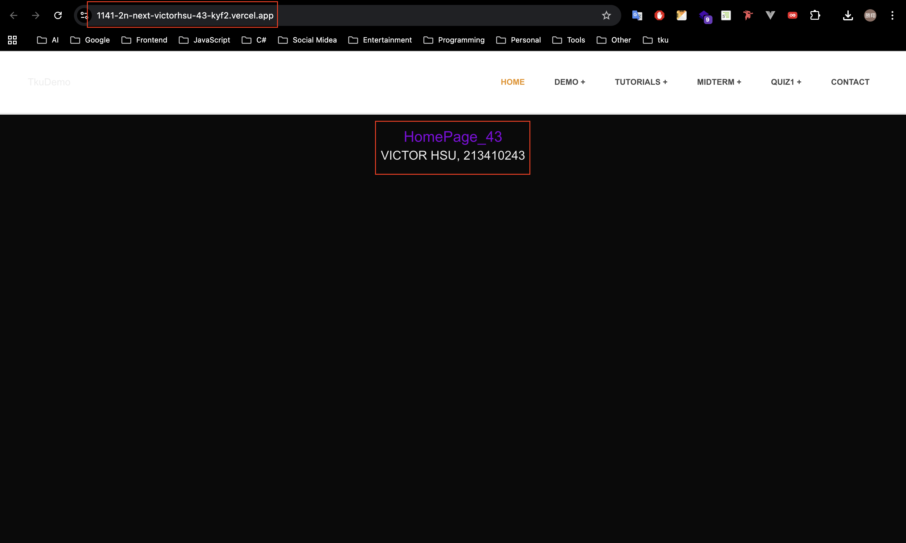
 
#### => Github repo and Vercel URL
 
[Gitbub Next URL](https://github.com/vic0627/1141-2n-next-victorhsu-43)
[Vercel Next URL](https://1141-2n-next-victorhsu-43-kyf2.vercel.app/)
 
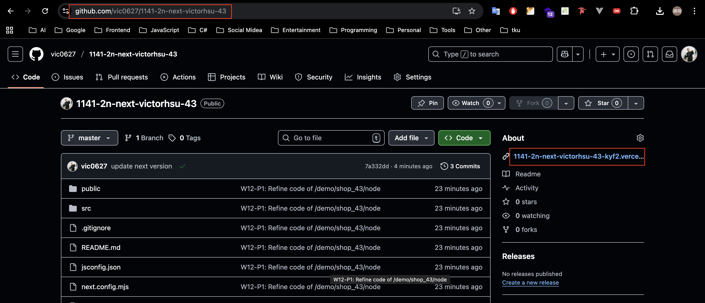
 
#### => Share to teacher and TA
 
htchung@gms.tku.edu.tw
sian-0018
 
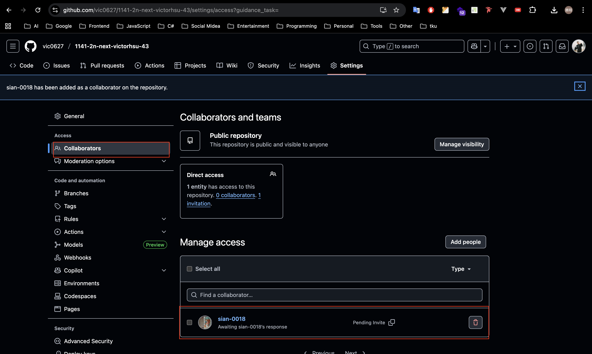
 
```
e2ce788 victor_xu       Sat Dec 6 18:10:19 2025 +0800   W12-P2: Deploy code to Vercel
```

### W12-P3: Implenment /demo/shop2_43/supabase to fetch products from Supabase
 
#### => use SQL to get category2_43 data
 
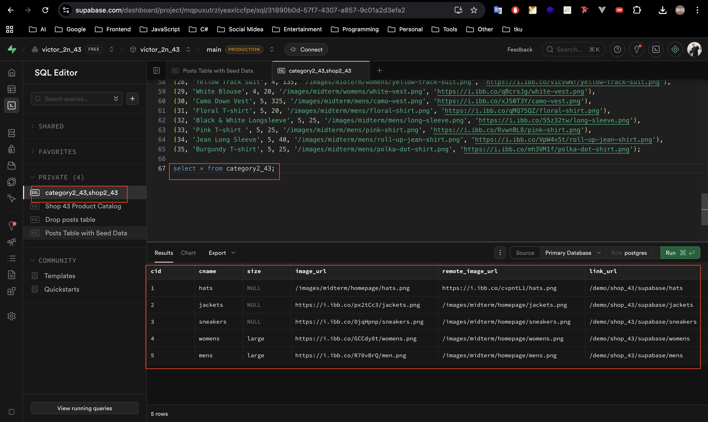
 
#### => use SQL to get shop2_43 data
 
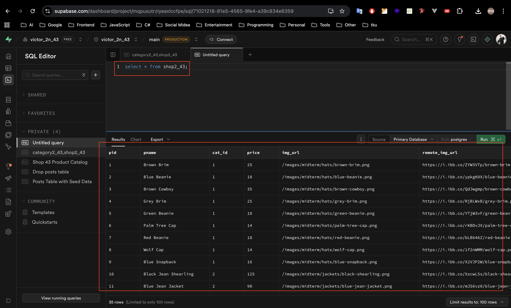
 
#### => set foreign key
 
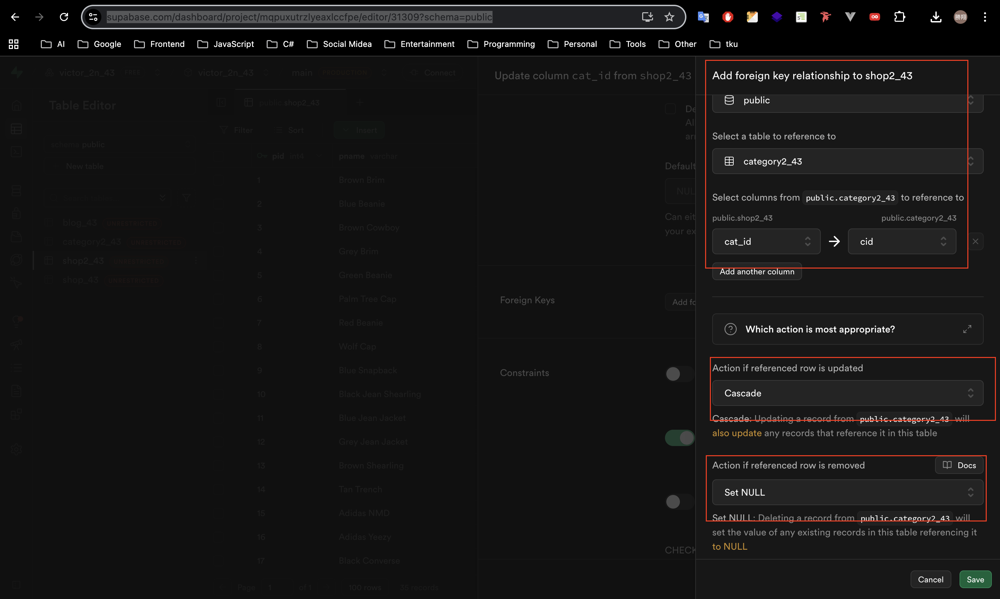
 
#### => set RLS policies for public access for all CRUD
 
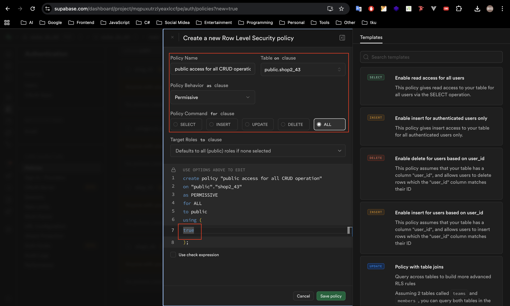
 
#### => Chrome -- local
 
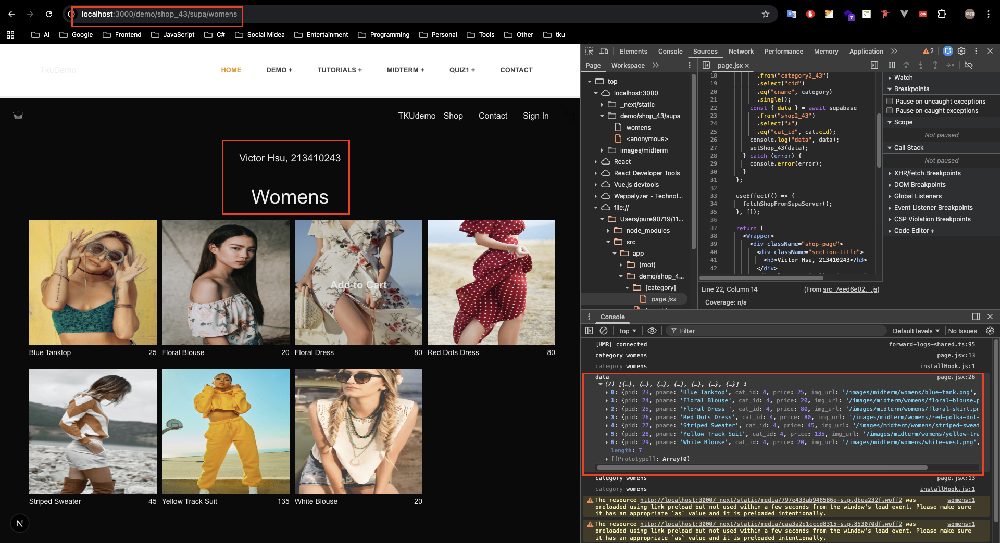
 
#### => Chrome -- Vercel
 
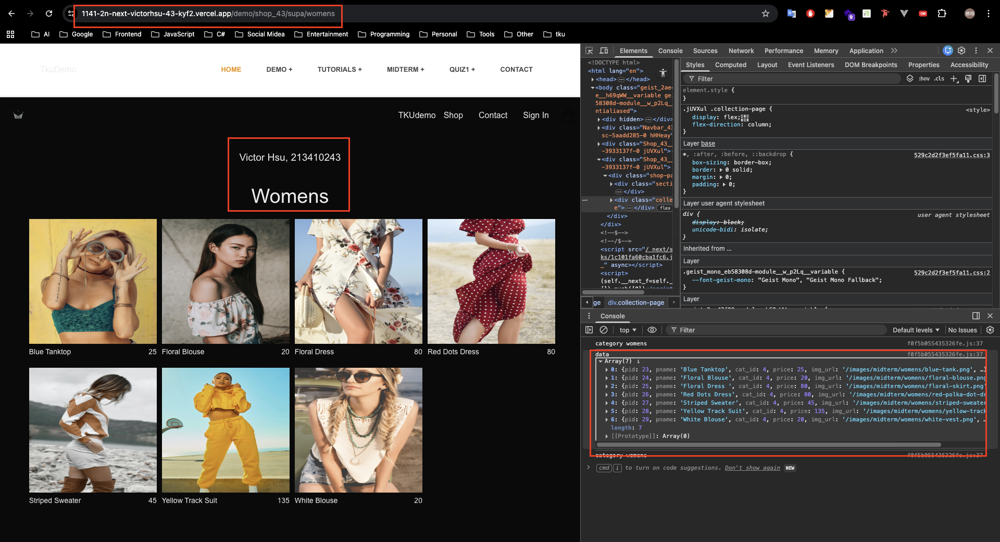
 
```
4a14524 victor_xu       Sat Dec 6 18:10:27 2025 +0800   W12-P3: Implenment /demo/shop2_43/supabase to fetch products from Supabase
```

### W12-logs: git logs of W12

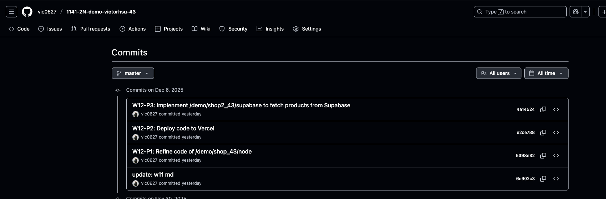