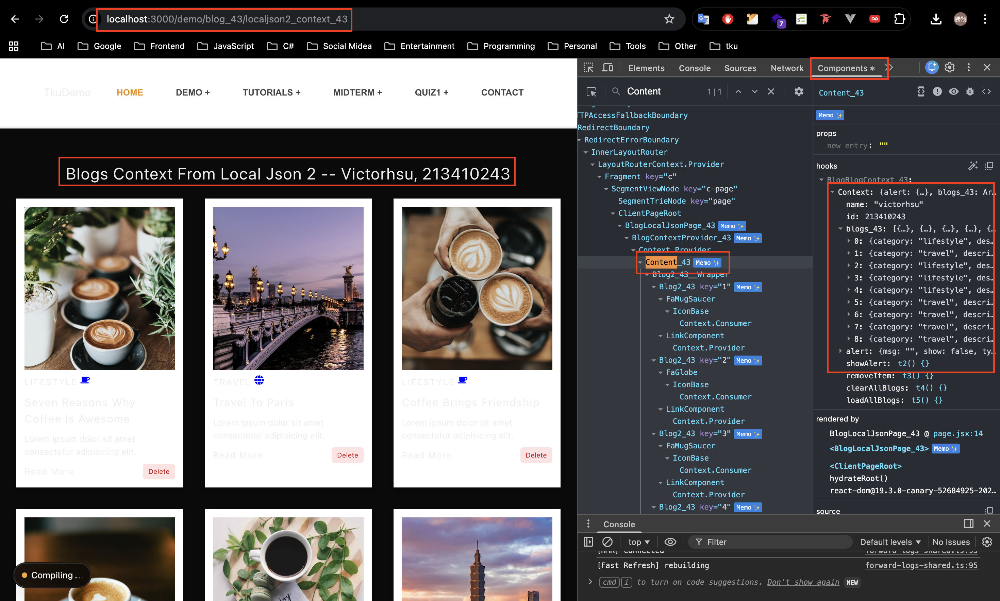
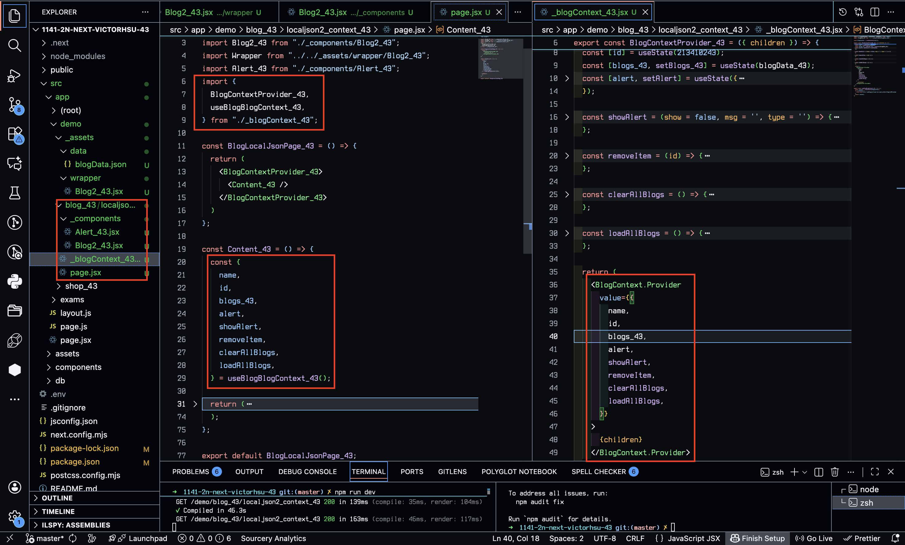
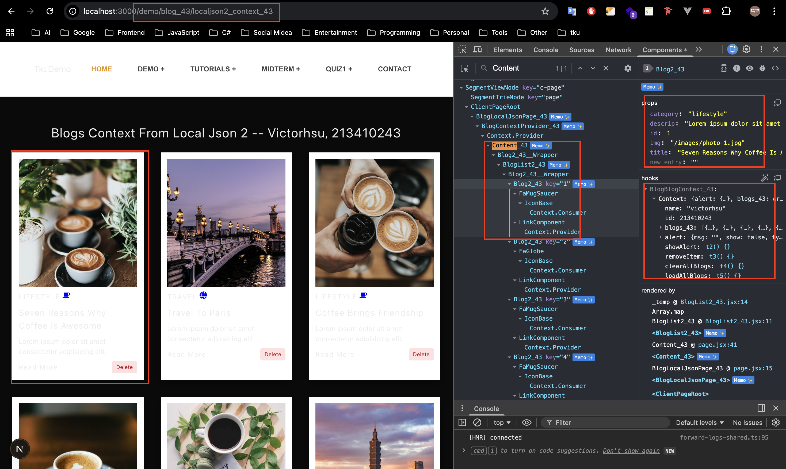
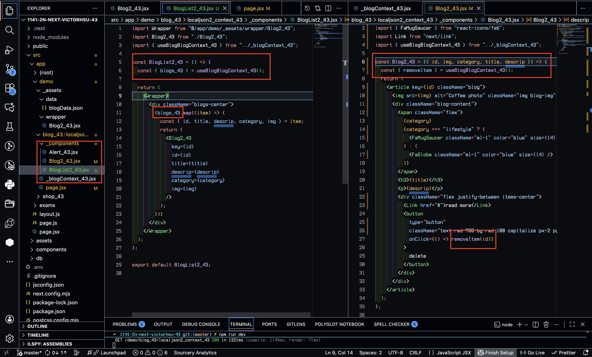
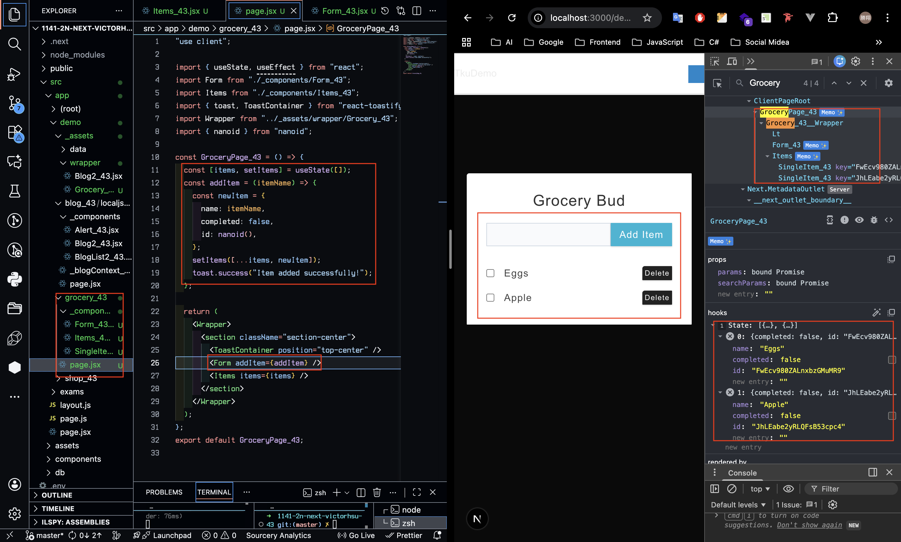
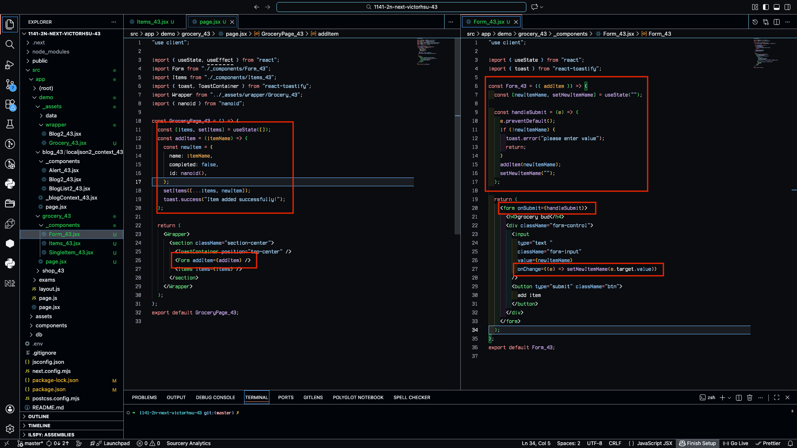
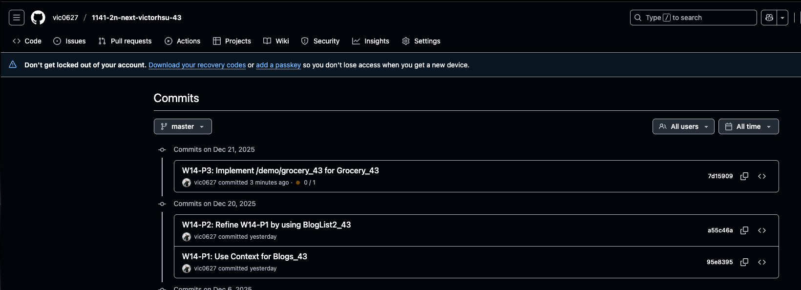

[GitHub URL](https://github.com/vic0627/1141-2N-demo-victorhsu-43)
[Github URL for Vercel](https://github.com/vic0627/1141_2N_demo_vercel_victorhsu_43)
[Vercel URL](https://1141-2-n-demo-vercel-victorhsu-43-28wbjt7l6-vic0627s-projects.vercel.app/)

### W14-P1: Use Context for Blogs_43
 
#### => Chrome, show blogs_43 in Content component
 

 
#### => relevant code
 

 
```
95e8395 victor_xu       Sat Dec 20 10:58:01 2025 +0800  W14-P1: Use Context for Blogs_43
```

### W14-P2: Refine W14-P1 by using BlogList2_43
 
#### => Chrome, show BlogList2_43, Blog2_43 component
 

 
#### => relevant code
 

 
```
a55c46a victor_xu       Sat Dec 20 11:29:13 2025 +0800  W14-P2: Refine W14-P1 by using BlogList2_43
```

### W14-P3: Implement /demo/grocery_43 for Grocery_43
 
#### => Chrome, add two data, and shown in components
 

 
#### => relevant code
 

 
```
7d15909 victor_xu       Sun Dec 21 13:33:56 2025 +0800  W14-P3: Implement /demo/grocery_43 for Grocery_43
```

### W14-logs: git logs of W14

