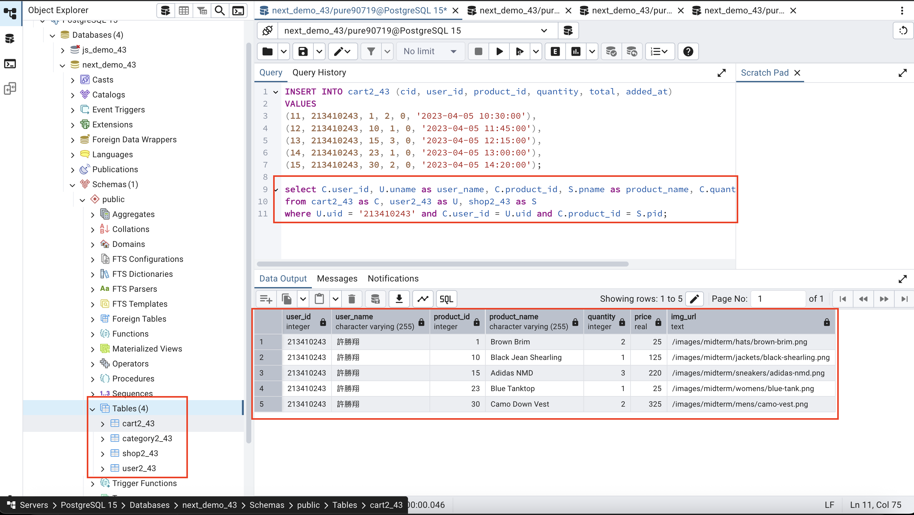
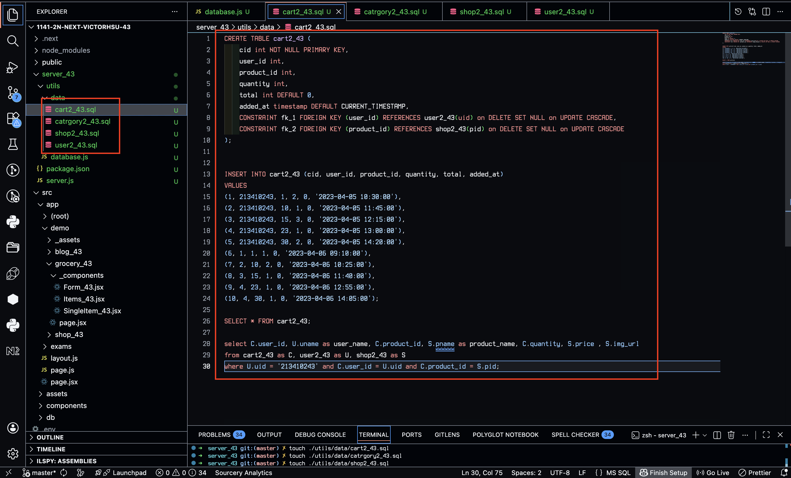
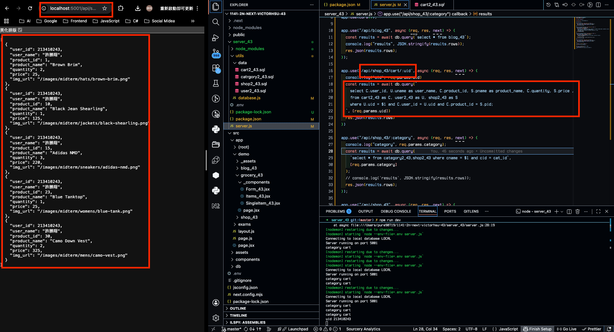
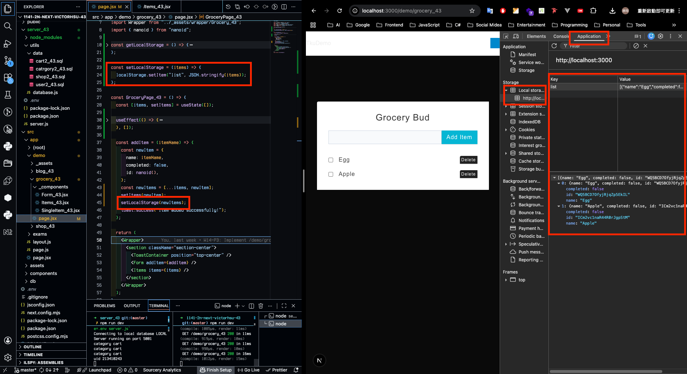
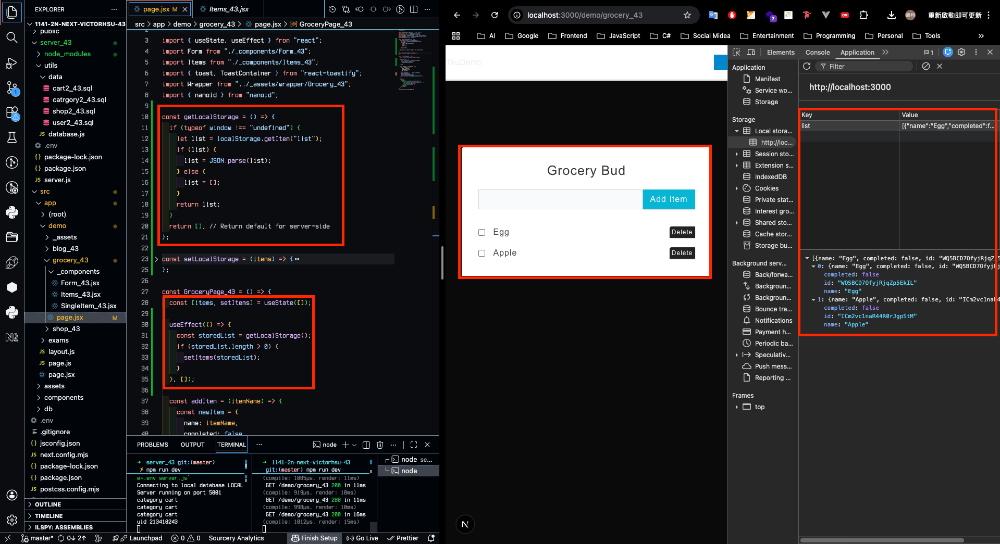
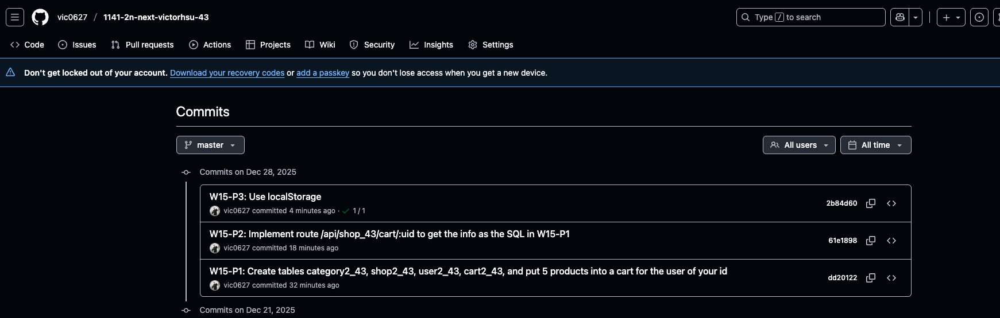

[GitHub URL](https://github.com/vic0627/1141-2N-demo-victorhsu-43)
[Github URL for Vercel](https://github.com/vic0627/1141_2N_demo_vercel_victorhsu_43)
[Vercel URL](https://1141-2-n-demo-vercel-victorhsu-43-28wbjt7l6-vic0627s-projects.vercel.app/)

### W15-P1: Create tables category2_43, shop2_43, user2_43, cart2_43, and put 5 products into a cart for the user of your id

#### => pgAdmin4, show SQL command to get the needed info



#### => sql code



```
dd20122 victor_xu       Sun Dec 28 15:13:59 2025 +0800  W15-P1: Create tables category2_43, shop2_43, user2_43, cart2_43, and put 5 products into a cart for the user of your id
```

### W15-P2: Implement route /api/shop_43/cart/:uid to get the info as the SQL in W15-P1



```
61e1898 victor_xu       Sun Dec 28 15:27:34 2025 +0800  W15-P2: Implement route /api/shop_43/cart/:uid to get the info as the SQL in W15-P1
```

### W15-P3: Use localStorage

#### => Implement setLocalStorage



#### => Implement getLocalStorage



```
2b84d60 victor_xu       Sun Dec 28 15:41:45 2025 +0800  W15-P3: Use localStorage
```

### W15-logs: git logs of W15


